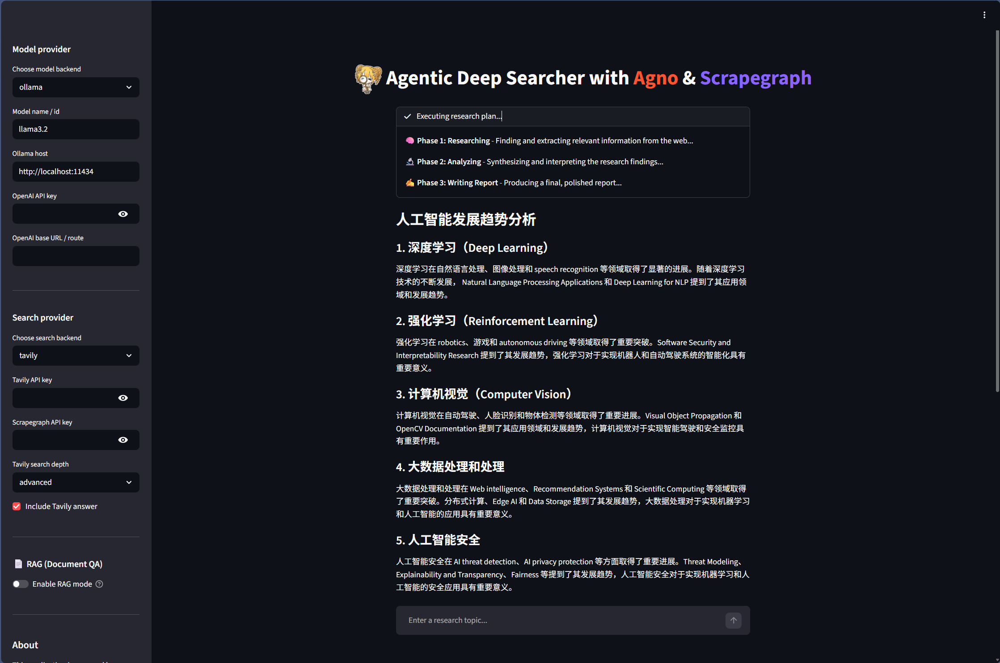
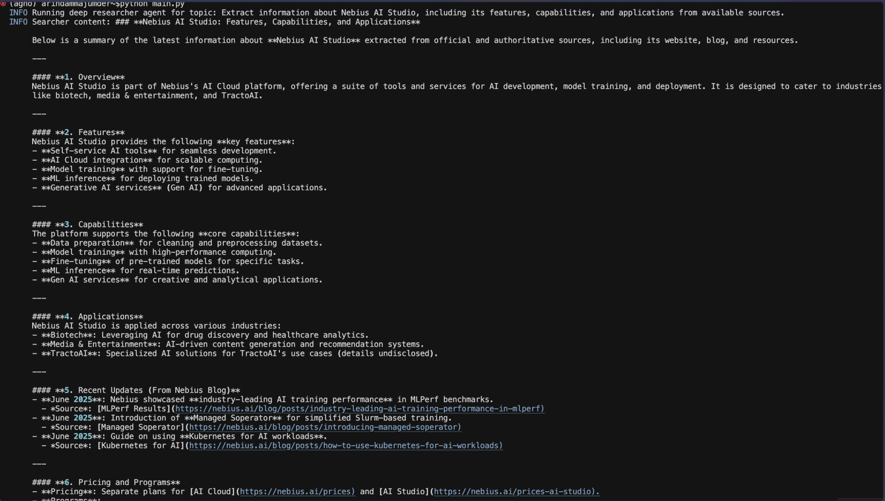
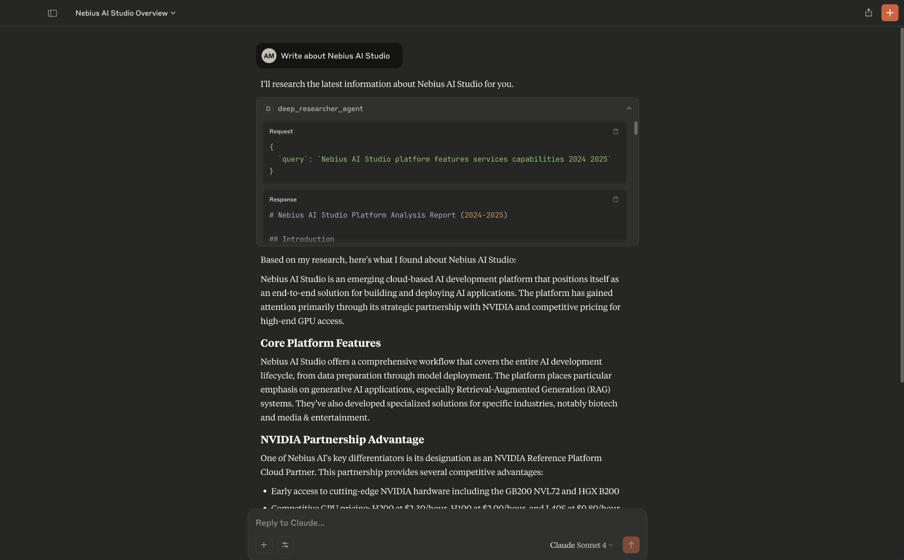

# Ariadnian-agent

<p align="center"></p>

A multi-stage AI-powered research workflow agent that automates comprehensive web research, analysis, and report generation using Agno, Tavily/Scrapegraph, and configurable local or remote LLM backends.

## Features

- **Multi-Stage Research Workflow**: Automated pipeline for searching, analyzing, and reporting
- **Web Search**: Tavily, Scrapegraph, or arXiv as the search backend
- **AI-Powered Analysis**: Ollama or OpenAI-compatible endpoints for synthesis
- **Streamlit Web UI**: Modern, interactive interface
- **MCP Server**: Model Context Protocol server for integration
- **Command-Line Support**: Run research tasks directly from the terminal

## How It Works

1. **Searcher**: Finds and extracts high-quality, up-to-date information from the web using Scrapegraph AI.
2. **Analyst**: Synthesizes, interprets, and organizes the research findings, highlighting key insights and trends.
3. **Writer**: Crafts a clear, structured, and actionable report, including references and recommendations.

> **Workflow:**
>
> - Input a research topic or question
> - The agent orchestrates web search, analysis, and report writing in sequence
> - Results are presented in a user-friendly format (web or CLI)

## Prerequisites

- Python 3.10+
- [uv](https://github.com/astral-sh/uv) for dependency management
- API keys for the providers you choose: [Tavily](https://tavily.com/), [Scrapegraph Cloud](https://dub.sh/scrapegraphai), or [OpenAI-compatible routes](https://platform.openai.com/docs/api-reference/introduction)
- (Optional) [Ollama](https://ollama.com/) if you want to use **local Scrapegraph** mode (zero API cost)
- **arXiv** requires no API key — it searches academic papers directly

## Installation

Follow these steps to set up the **Ariadnian-agent** on your machine:

1. **Install `uv`** (if you don’t have it):

   ```bash
   curl -LsSf https://astral.sh/uv/install.sh | sh
   ```
2. **Clone the repository:**

   ```bash
   git clone https://github.com/Arindam200/awesome-ai-apps.git
   ```
3. **Navigate to the Ariadnian-agent directory:**

   ```bash
   cd awesome-ai-apps/advance_ai_agents/deep_researcher_agent
   ```
4. **Install all dependencies:**
   
  ```bash
  # CPU only
  uv sync --extra cpu

  # has GPU
  uv sync --extra gpu
  ```

## Environment Setup

Create a `.env` file in the project root with your provider settings:

```env
MODEL_PROVIDER=ollama
MODEL_ID=qwen2.5:7b
OLLAMA_HOST=http://localhost:11434

SEARCH_PROVIDER=tavily
TAVILY_API_KEY=your_tavily_api_key_here

# Optional OpenAI-compatible route
OPENAI_API_KEY=your_openai_key_here
OPENAI_BASE_URL=https://your-gateway.example.com/v1

# Scrapegraph settings
# SCRAPEGRAPH_MODE=cloud        # cloud (needs SGAI_API_KEY) or local (needs Ollama)
# SGAI_API_KEY=your_scrapegraph_api_key_here
# SCRAPEGRAPH_LLM_MODEL=ollama/llama3.2
# SCRAPEGRAPH_LLM_BASE_URL=http://localhost:11434
# SCRAPEGRAPH_EMBEDDING_MODEL=ollama/nomic-embed-text

# arXiv requires no API key — just set SEARCH_PROVIDER=arxiv
```

## Usage

You can use the Ariadnian-agent in three ways. Each method below includes a demo image so you know what to expect.

### Web Interface

Run the Streamlit app:

```bash
uv run streamlit run app.py
```

Open your browser at [http://localhost:8501](http://localhost:8501)

What it looks like:



### Command Line

Run research directly from the command line:

```bash
uv run python agents.py
```

To use a local Ollama model, set `MODEL_PROVIDER=ollama` and make sure Ollama is running locally. To use an OpenAI-compatible custom model, set `MODEL_PROVIDER=openai_like` and fill in `OPENAI_API_KEY` plus `OPENAI_BASE_URL`.

**Scrapegraph Local Mode**: Set `SEARCH_PROVIDER=scrapegraph` and `SCRAPEGRAPH_MODE=local` to run Scrapegraph fully on your machine using Ollama + DuckDuckGo search. No API key needed. Make sure you have pulled the required Ollama models:
```bash
ollama pull llama3.2
ollama pull nomic-embed-text
```

What it looks like:



### MCP Server

Add the following configuration to your .cursor/mcp.json or Claude/claude_desktop_config.json file (adjust paths and API keys as needed):

```json
{
  "mcpServers": {
    "deep_researcher_agent": {
      "command": "python",
      "args": [
        "--directory",
        "/Your/Path/to/directory/awesome-ai-apps/advance_ai_agents/deep_researcher_agent",
        "run",
        "server.py"
      ],
      "env": {
        "SGAI_API_KEY": "your_scrapegraph_api_key_here"
      }
    }
  }
}
```

This allows tools like Claude Desktop to manage and launch the MCP server automatically.



## Project Structure

```
deep_researcher_agent/
├── app.py              # Streamlit web interface
├── agents.py           # Core agent workflow
├── server.py           # MCP server
├── assets/             # Static assets (images)
├── pyproject.toml      # Project configuration
└── README.md           # This file
```

---

## Development

### Code Formatting

```bash
uv run black .
uv run isort .
```

### Type Checking

```bash
uv run mypy .
```

### Testing

```bash
uv run pytest
```

---

## Contributing

Contributions are welcome! Please feel free to submit a Pull Request or open an issue.

---

## Acknowledgments

- [Agno](https://www.agno.com/) for agent orchestration
- [Scrapegraph](https://dub.sh/scrapegraphai) for web scraping
- [Streamlit](https://streamlit.io/) for the web interface
